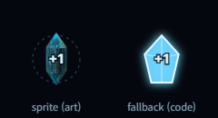
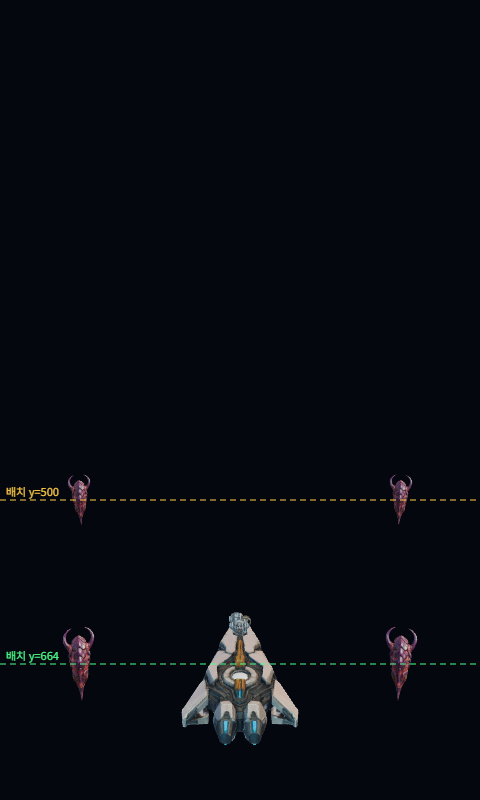
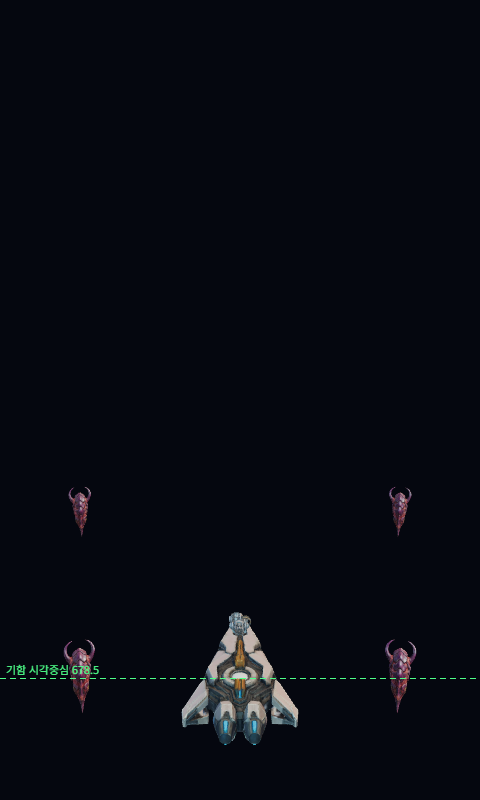
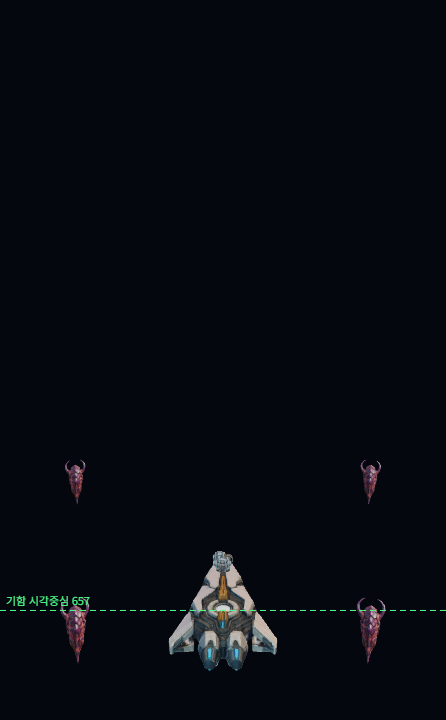
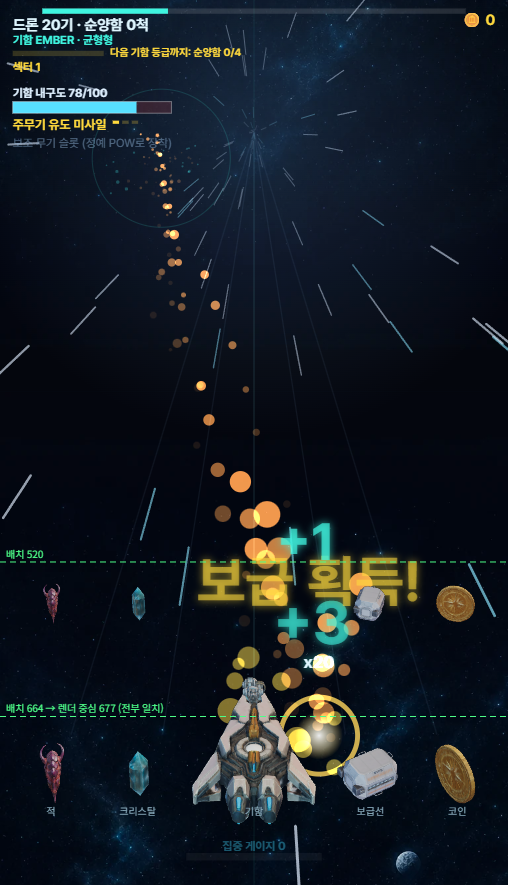

# §G-38 — "시작할 때 5각형 크리스탈" 제보 처리

이사님 제보(2026-08-12): **"시작할 때 5각형 크리스탈이 날아온다."**

## 진단

그 오각형은 **아트가 아니라 폴백 코드 도형**이다.
`js/entities.js` 의 `Crystal.draw()` 는 `getSprite('C1')` 이 null 일 때만 코드로 오각형을 그린다.



왼쪽이 실제 아트(`nf2_prop_p1_crystal.webp`), 오른쪽이 폴백이다.
**오른쪽이 제보 스크린샷의 그 모양이다.**

## 원인 — 아트 요청이 5.1초에야 시작됐다

dist 브라우저 resource timing 실측:

| 항목 | 값 |
|---|---|
| domContentLoaded | 5,103ms |
| 크리스탈 요청 **시작** | 5,101ms |
| 크리스탈 완료 | 6,123~7,492ms (실행마다 변동) |
| 모든 JS 완료 | 6,438~6,624ms |

두 가지가 겹쳤다.

1. **`preloadStyle()` 이 `main.js` 안에 있었다.** ES 모듈은 import 그래프를 전부 받아야 본문이 실행된다.
   main.js 266KB + three.module.js 670KB 를 다 받을 때까지 아트는 한 바이트도 요청되지 않는다.
   ⚠️main.js **안에서** 호출 위치를 위로 올려도 소용없다 — 본문 시작 자체가 늦기 때문이다.
2. **43개를 `Promise.all` 로 한꺼번에 던졌다.** 브라우저는 호스트당 6개만 동시에 받는다.
   4.5KB 짜리 크리스탈이 1,618ms 걸린 것은 전송이 아니라 **큐 대기**다.

## 수정 (3단)

| # | 수정 | 파일 |
|---|---|---|
| 1 | `<link rel="preload">` — HTML 파싱 단계에서 최우선으로 6개 | `index.html` |
| 2 | 부트 모듈 분리 — `sprites.js`(18KB)만 건드려 main.js 그래프와 병렬로 로드 | `js/preload-boot.js` |
| 3 | 선로딩 2파 분리 — 먼저 보이는 것부터 | `js/sprites.js` |

⚠️게임 로직·스폰·밸런스·판정은 **건드리지 않았다.** 받는 **시점과 순서**만 바꿨다.
⚠️폴백 코드는 **그대로 둔다** — 최후의 안전망이다. 지우면 로드 실패 시 오브젝트가 투명해진다.

## 결과 (같은 환경 실측)

| | 이전 | 이후 |
|---|---|---|
| 크리스탈 요청 시작 | 5,123ms | **333ms** |
| 크리스탈 완료 | 6,742ms | **658ms** |
| 모든 JS 완료 대비 | **+868ms 늦음** (창 열림) | **−5,780ms 먼저** (창 닫힘) |

기함 선체 668ms · 보급 수송선 1,289ms 로 함께 들어온다.

## 2차 — 적 스프라이트도 (이사님 추가 지시)

1차 수정 뒤에도 `A1`~`A3`(적, 33~37KB)은 **5.3~6.4초**에 완료됐다. 원인을 다시 팠다.

**서버는 무죄다.** 단독 요청 실측: 38KB 파일 **3ms**, 6개 병렬 **288ms**.

**진짜 원인은 우선순위였다.** Chrome 은 `<link rel="preload" as="image">` 를 기본 **Low** 로,
모듈 스크립트를 **High** 로 잡는다. JS 56개(1.06MB) 뒤에서 이미지가 굶었다:

```text
모든 JS 완료   5,316ms
A2.webp 완료   5,315ms      ← 정확히 같이 끝났다
```

→ preload 링크에 **`fetchpriority="high"`** 를 붙였다.

| 파일 | fetchpriority 전 | 후 |
|---|---|---|
| 크리스탈 | 6,123~7,492ms | **374ms** |
| A1 | 960ms | **381ms** |
| A2 | **5,315ms** | **388ms** |
| A3 | **5,593ms** | **669ms** |

즉시 아트 6종 전부 **37ms 요청 · 669ms 완료**. 모든 JS 완료(5,095ms)보다 **4.4초 먼저** 준비된다.

⚠️수치는 로컬 Python 서버(`no-store`·무압축·HTTP/1.1) 기준으로 **최악 조건**이다.
실제 포털(CDN·HTTP/2·캐시)에서는 더 빠르다.

## 3차 — 적 3D 높이 (이사님 추가 지시)

이사님: "적이 기함 위치로 내려왔을 때 기함보다 위에 떠 있는 느낌이야."

**첫 가설은 틀렸다.** 고도(월드 y)를 의심해 재 보니 화면 중단의 적은 실제로 기함 평면보다
**+0.97 ~ +1.14 유닛 위**에 있었다. 평면에 얹는 보정을 넣고 렌더했더니 — **화면상 변화가 0** 이었다.
`placeSwarm` 은 화면 위치·크기를 맞추고 고도를 **결과로** 두는 구조라, 고도만 바꾸면 보이지 않는다.
그 실험은 되돌렸다.

**실제 원인은 모델의 시각 중심이었다.** 같은 배치점(화면 y=664)에 놓고 렌더 알파 경계를 쟀다:

| | top | bottom | **중심** |
|---|---|---|---|
| 적 | 627 | 700 | **663.5** ← 배치점에 정렬 |
| 기함 | 612 | 745 | **678.5** ← 배치점보다 **15px 아래** |

기함 모델은 엔진·꼬리가 원점 아래로 뻗어 시각 중심이 낮고, 적 모델은 중심 정렬이다.
같은 위치인데 기함이 낮게 보이니 적이 떠 있는 것으로 읽혔다.

→ `ENEMY_VIS_DROP` (월드 유닛) 만큼 적을 내렸다. 값은 두 단계로 정해졌다.

같은 프레임에서 잰 **기함 중심 − 오브젝트 중심**(음수 = 오브젝트가 아래):

| 값 | 차이 | 판정 |
|---|---|---|
| 0 | **+15.0** | 떠 보임 — 최초 제보 상태 |
| 0.26 | +2.5 | 시각 중심 **정렬**(기하학적 기준선) |
| 0.52 | −10.0 | 이사님 "한칸만 더" |
| **0.78** | **−21.0** | **현재** — 이사님 "한 포인트 더" |

한 칸 ≈ 0.26 이고 기함 근처에서 화면 약 12px 씩 움직인다.






⚠️**현재 값은 "계산으로 나오는 정답"이 아니다.** 0.26 이 시각 중심이 맞는 기하학적 기준선이고,
그 아래(0.52·0.78)는 **이사님의 연출 선택**이다(2026-08-12). 바꾸려면 확인을 받아라.

⚠️**기함에는 유휴 흔들림 애니메이션이 있다** — 절대 y 가 프레임마다 ±8px 흔들린다.
 비교는 반드시 **같은 프레임 안에서** 해야 한다. (측정 도중 기함 중심이 678.5 → 657 로 읽혀
 혼선이 있었는데, 값이 바뀐 게 아니라 흔들림 위상이 달랐던 것이다.)

## 4차 — 날아오는 오브젝트 전부 동일하게 (이사님 추가 지시)

이사님: "날아오는 모든 오브젝트 위치를 다 동일하게 맞춰줘. 크리스탈, 보급선, 운석, 등등."

- **운석(h1)·잔해(h2)는 이미 적 테이블(`ENEMY3D`)에 있어** 처음부터 같은 보정을 받고 있었다.
- 남은 것은 **픽업**(크리스탈·보급 수송선·코인·POW) — `props` 경로라 보정이 0 이었다.
- 상수 이름을 `ENEMY_VIS_DROP` → **`WORLD_OBJ_VIS_DROP`** 로 바꾸고(옛 이름은 별칭 유지)
  적 스웜과 픽업 **양쪽에** 넘긴다.

**같은 프레임 · 같은 배치점(664) 실측 — 렌더 중심:**

| 적 | 크리스탈 | 보급선 | 코인 |
|---|---|---|---|
| 676.4 | 677.0 | 677.0 | 677.0 |

**±0.6px 안에서 일치.**



⚠️**발사체는 일부러 제외했다.** 아군탄은 기함 포구에서 나가고 적탄은 기함에 맞는다 —
 내리면 포구 정합(`muzzleGapPx` 0)과 명중 위치가 어긋난다. `behindFlag=false` 인 이유와 같다.
 테스트 `G38-VIS-DROP-SCOPE` 가 "적·픽업은 받고 발사체는 안 받는다"를 확인한다.

⚠️**화면 고정 px 가 아니라 월드 오프셋**이다 — 원근이 자연스럽게 적용된다.
원근 실측: 가까울수록 많이, 멀수록 적게 내려간다(화면 고정 px 였다면 전부 같은 양이라 원근이 깨진다).
화면 px 로 내렸다면 먼 적까지 같은 양으로 밀려 원근이 깨진다.

⚠️**렌더 전용이다.** 2D 판정·충돌·스폰은 그대로다. 테스트 `G38-VIS-DROP-RENDER-ONLY` 가
`balance.js`·`collision.js`·`entities.js`·`main.js` 가 이 상수를 읽지 않는 것을 확인한다.

## 회귀 방지

`tests/g38-preload-waves.test.mjs` 5개:
- `G38-WAVES-COVER-ALL` — 2파를 합치면 예전 목록을 빠짐없이 덮는가
- `G38-FIRST-WAVE-HAS-PICKUPS` — C1·C5·선체가 1파의 **앞 6번 안**에 있는가
- `G38-FIRST-WAVE-SMALL` — 1파가 지나치게 커져 다시 경합하지 않는가
- `G38-WAVE-IDS-RESOLVE` — 목록에 오타 id 가 없는가(오타면 조용히 폴백 영구 노출)
- `G38-HTML-PRELOAD-MATCHES` — index.html 링크가 `INSTANT_ART` 와 정확히 일치하는가

- `G38-PRELOAD-PRIORITY` — 모든 preload 링크에 `fetchpriority="high"` 가 있는가

`tests/g38-enemy-vis-drop.test.mjs` 2개:
- `G38-VIS-DROP-VALUE` — 보정량이 폭주 방지 범위(12~60px @깊이14) 안이고, 멀리서는 원근으로 줄어드는가
- `G38-VIS-DROP-SCOPE` — 적·픽업이 **같은 값**을 받고 발사체는 안 받는가
- `G38-VIS-DROP-COVERS-METEOR` — 운석(h1)·잔해(h2)가 보정 대상 테이블에 있는가
- `G38-VIS-DROP-ALIAS` — 옛 이름 `ENEMY_VIS_DROP` 이 같은 값을 가리키는가(갈라지면 픽업만 안 내려간다)
- `G38-VIS-DROP-RENDER-ONLY` — 게임 truth 모듈이 이 상수를 읽지 않는가

자기검증(전부 확인함):
- C1 을 1파 → 2파로 옮기면 `G38-FIRST-WAVE-HAS-PICKUPS` 실패
- `fetchpriority="high"` 를 하나 지우면 `G38-PRELOAD-PRIORITY` 실패
- `ENEMY_VIS_DROP` 을 0 으로 두면 `G38-VIS-DROP-VALUE` 실패(0.26·0.52 는 둘 다 통과 — 그 사이는 취향 구간)
